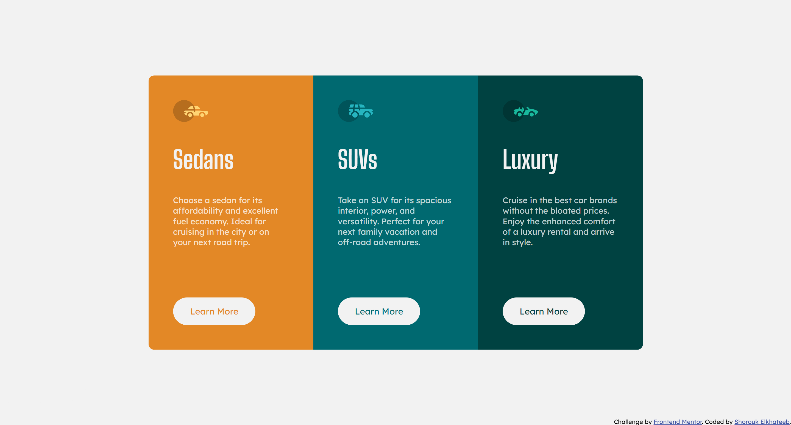

# Frontend Mentor - 3-column preview card component solution

This is a solution to the [3-column preview card component challenge on Frontend Mentor](https://www.frontendmentor.io/challenges/3column-preview-card-component-pH92eAR2-). Frontend Mentor challenges help you improve your coding skills by building realistic projects. 

## Table of contents

- [Overview](#overview)
  - [The challenge](#the-challenge)
  - [Screenshot](#screenshot)
  - [Links](#links)
- [My process](#my-process)
  - [Built with](#built-with)
  - [What I learned](#what-i-learned)
- [Author](#author)

## Overview

### The challenge

Users should be able to:

- View the optimal layout depending on their device's screen size
- See hover states for interactive elements

### Screenshot



### Links

- Solution URL: [GitHub Repository](https://github.com/shElkhateeb/3-column-preview-card-component-main)
- Live Site URL: [GitHub Pages](https://shelkhateeb.github.io/3-column-preview-card-component-main/)

## My process

### Built with

- Semantic HTML5 markup
- CSS custom properties
- Flexbox
- Mobile-first workflow

### What I learned

```css
@media screen and (min-width: 620px) {
  :root {
    --cols-per-row: 2;
  }
  section:nth-child(2),
  section:last-child {
    border-bottom-right-radius: 10px;
  }
}
@media screen and (min-width: 920px) {
  :root {
    --cols-per-row: 3;
  }
  section:nth-child(2) {
    border-bottom-right-radius: 0;
  }
}
```

## Author

- Frontend Mentor - [@shElkhateeb](https://www.frontendmentor.io/profile/shElkhateeb)